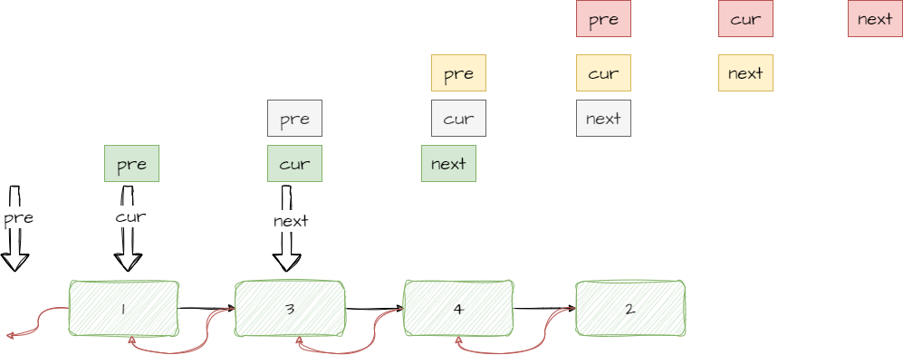

### 题目链接

[反转链表](https://leetcode-cn.com/problems/fan-zhuan-lian-biao-lcof/)

### 题目描述

定义一个函数，输入一个链表的头节点，反转该链表并输出反转后链表的头节点。

### 题目思路

使用三个指针`cur`,`pre`,`next`,来进行反转

<!-- 插入图片 -->



:::code-tabs#code
@tab typescript

```typescript
function reverseList(head: ListNode | null): ListNode | null {
  // 需要三个指针
  let pre: ListNode | null = null;
  let cur: ListNode | null = head;
  let next: ListNode | null = null;
  while (cur !== null) {
    // 搞好退路
    next = cur.next;
    // 反转
    cur.next = pre;
    // 更新指针
    pre = cur;
    cur = next;
  }
  return pre;
}
```
