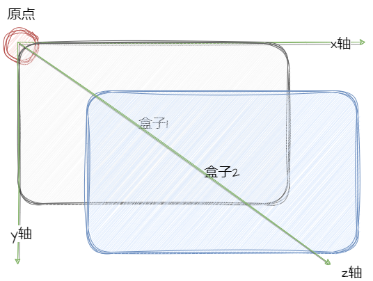
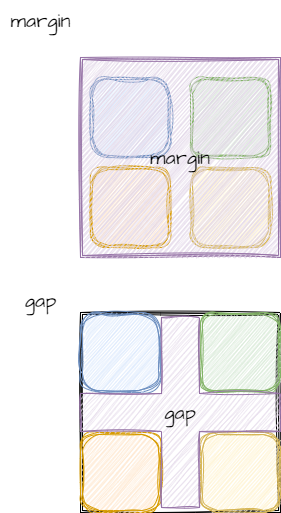

#### 坐标轴

一般来说，web 中的坐标轴，我们成为`web`坐标轴，它是以左上角为原点，向右为 x 轴正方向，向下为 y 轴正方向，向屏幕外为 z 轴正方向。

<!-- 插入图片 -->



像图中所展示，当我们设置`z-index`的时候，他其实是向右下方向的，也就是说，`z-index`越大，他的层级越高，也就是越靠近我们的视角。

#### 书写方向

书写方向，就是我们的文字书写的方向，一般来说，我们的书写方向是从左到右，从上到下，但是也有一些特殊的书写方向，比如说阿拉伯语，他的书写方向是从右到左，从上到下。

```css
/* 书写方向 */
writing-mode: horizontal-tb | vertical-rl | vertical-lr;
```

这个属性就是用来设置书写方向的，`horizontal-tb`就是我们的默认书写方向，`vertical-rl`就是从上到下，从右到左，`vertical-lr`就是从上到下，从左到右。

#### 间距

间距一般情况下分为两种，一种是框和框之间的间距，一种是文字和框之间的间距。

```css
/* 框和框之间的间距 */
margin: 10px 20px 30px 40px;

gap: 10px 20px 30px 40px;
/* 文字和框之间的间距 */
padding: 10px 20px 30px 40px;
```

这边介绍一下`gap`和`margin`的区别：
- `margin`和`gap`是可以用来设置框和框之间的间距的
- 但是`gap`只能用在`flex`布局中，而`margin`可以用在任何布局中。
- **并且`gap`表示的是行和列之间的间距**

<!-- 插入图片 -->
