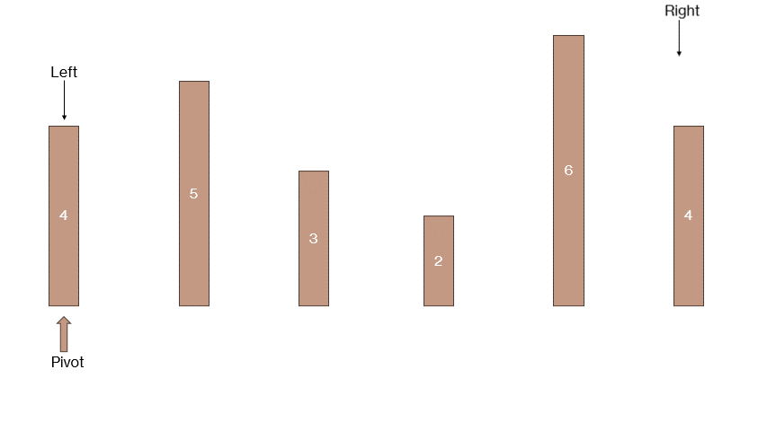

## 快速排序

### 什么是快速排序

快速排序就是将一个数组分成两个子数组，然后递归的对子数组进行排序，这里的排序是指将子数组的元素进行交换，使得左边的元素都小于右边的元素。

### 快速排序基础版本(迭代法)

思路:

- 找最左边的数作为基准值
- 然后分别从右往左再从左往右找到第一个小于和大于基准值的数，然后交换这两个数
- 一直重复上面的步骤，直到`left`和`right`相等
- 将基准值和`left`和`right`相等的位置进行交换
- 至此，我们就将数组分成了两个子数组，然后递归的对子数组进行排序

```typescript
function sortArray(nums: number[]): number[] {
  quickSort(nums, 0, nums.length - 1);
  return nums;
}
function quickSort(nums: number[], left: number, right: number): void {
  // 设置递归终止条件
  if (left >= right) {
    return;
  }
  let start = left;
  // 设置基准值
  let pivot = nums[left];
  while (left < right) {
    // 从右向左找到第一个小于基准值的数
    while (left < right && nums[right] >= pivot) {
      right--;
    }
    // 从左往右找到第一个大于基准值的数
    while (left < right && nums[left] <= pivot) {
      left++;
    }
    // 将这两个数进行交换
    if (left < right) {
      let temp = nums[left];
      nums[left] = nums[right];
      nums[right] = temp;
    }
  }
  // 将基准值和left和right相等的位置进行交换
  nums[start] = nums[left];
  nums[left] = pivot;

  // 递归处理左边的数组
  quickSort(nums, start, left - 1);
  // 递归处理右边的数组
  quickSort(nums, left + 1, right);
}
```

可能代码并没有那么好理解，那么我们可以通过图来进行理解：

  
**但是上面的图只演示了单次排序的逻辑**
单次排序以后我们就可以保证，在`left`前面的数都小于`left`，在`left`后面的数都大于`left`，但是我们还需要对`left`前面的数组和`left`后面的数组进行排序，所以我们需要递归的对`left`前面的数组和`left`后面的数组进行排序。

**这种方法在 Leetcode 里不会超时**

### 快速排序基础版本(递归法)

思路：

- 我们直接初始化两个数组`left`和`right`，一个用来存放小于基准值的数，一个用来存放大于基准值的数
- 将原数组从左往右遍历，将小于基准值的数放到`left`数组中，将大于基准值的数放到`right`数组中
- 一次遍历结束，我们就将原数组分成了三个部分，`left`数组，`right`数组，以及基准值
- 至此，我们也会得到两个子数组，然后递归的对子数组进行排序

**但是需要注意他的递归终止条件**：当这个数组里面只有一个值或者数组为空，那么它其实就是已经排好顺序了。

```typescript
function sortArray(nums: number[]): number[] {
  return quickSort(nums);
}

function quickSort(nums: number[]): number[] {
  // 设置递归终止条件
  if (nums.length <= 1) {
    return nums;
  }
  // 设置初始值
  let left = [];
  let right = [];
  let pivot = nums[0];
  // 遍历
  for (let i = 1; i < nums.length; i++) {
    if (nums[i] < pivot) {
      left.push(nums[i]);
    } else {
      right.push(nums[i]);
    }
  }
  // 递归处理左边的数组
  left = quickSort(left);
  // 递归处理右边的数组
  right = quickSort(right);
  // 将左边的数组，基准值，右边的数组拼接起来
  return left.concat(pivot, right);
}
```

我们也用一张图来进行理解:


**当然这也只是单层逻辑的图**

这个方法写起来非常简单，并且很容易明白，但是很可惜，这种方法在 Leetcode 里会超时，所以我们还需要对这种方法进行优化。

### 快速排序优化版本（三数取中）

思路：

- 我们选择`left`和`right`和`mid`三个数中的中间值作为基准值
- **注意比较**
- 我们需要保证：
  - 左边的数都小于基准值
  - 左边的数都小于右边的数
  - 右边的数都大于基准值

```typescript
function sortArray(nums: number[]): number[] {
  quickSort(nums, 0, nums.length - 1);
  return nums;
}
function swap(nums: number[], left: number, right: number) {
  let temp = nums[left];
  nums[left] = nums[right];
  nums[right] = temp;
}
function quickSort(nums: number[], left: number, right: number) {
  // 递归终止条件
  if (left >= right) {
    return;
  }
  // 三数取中
  let mid = Math.floor((left + right) / 2);
  let leftValue = nums[left];
  let rightValue = nums[right];
  let midValue = nums[mid];
  if (leftValue > midValue) {
    swap(nums, left, mid);
  }
  if (leftValue > rightValue) {
    swap(nums, left, right);
  }
  if (midValue > rightValue) {
    swap(nums, mid, right);
  }
  // 这时候中间值就是基准值
  let pivot = nums[mid];
  // 设置指针
  let start = left;
  let end = right;

  while (left < right) {
    // 从右向左找到第一个小于基准值的数
    while (left < right && nums[right] >= pivot) {
      right--;
    }
    // 从左往右找到第一个大于基准值的数
    while (left < right && nums[left] <= pivot) {
      left++;
    }
    // 将这两个数进行交换
    if (left < right) {
      swap(nums, left, right);
    }
  }
  // 将基准值和left和right相等的位置进行交换
  [nums[start], nums[left]] = [nums[left], nums[start]];

  // 递归处理左边的数组
  quickSort(nums, start, left - 1);
  // 递归处理右边的数组
  quickSort(nums, left + 1, end);
}
```

上面的方法其实是`WA`的，具体为啥，没搞明白！

### 快速排序优化版本（三数取中）递归版本

思路：其实和上面的思路一致，只不过是将上面的方法改成了递归的方法

```typescript
function quickSort2(nums: number[]): number[] {
  // 确定递归终止条件
  if (nums.length <= 1) return nums;
  // 单层递归逻辑
  let left: number[] = [];
  let right: number[] = [];
  // 三数取中法
  let mid: number = Math.floor(nums.length / 2);
  // 判断三个数的大小
  // 左边值大于中间值，交换。确保左边值小于中间值
  if (nums[0] > nums[mid]) {
    [nums[0], nums[mid]] = [nums[mid], nums[0]]; // 为什么这样可以改变原数组？ 交换的是数组的元素，而不是变量的值
  }
  // 左边值大于右边值，交换。确保左边值小于右边值
  if (nums[0] > nums[nums.length - 1]) {
    [nums[0], nums[nums.length - 1]] = [nums[nums.length - 1], nums[0]];
  }
  // 中间值大于右边值，交换。确保中间值小于右边值
  if (nums[mid] > nums[nums.length - 1]) {
    [nums[mid], nums[nums.length - 1]] = [nums[nums.length - 1], nums[mid]];
  }
  // console.log("quickSort2", nums);

  // 将中间数作为基准值
  let pivot: number = nums[mid];
  // console.log("quickSort2", pivot, mid);

  for (let i = 0; i < nums.length; i++) {
    if (i === mid) continue;
    if (nums[i] < pivot) {
      left.push(nums[i]);
    } else {
      right.push(nums[i]);
    }
  }
  // 递归
  let resLeft: number[] = quickSort2(left);
  let resRight: number[] = quickSort2(right);
  return [...resLeft, pivot, ...resRight];
}
```

## 总结

快速排序的方法有很多，后续再慢慢整理吧！！
最近不想看了，太伤人了！！！