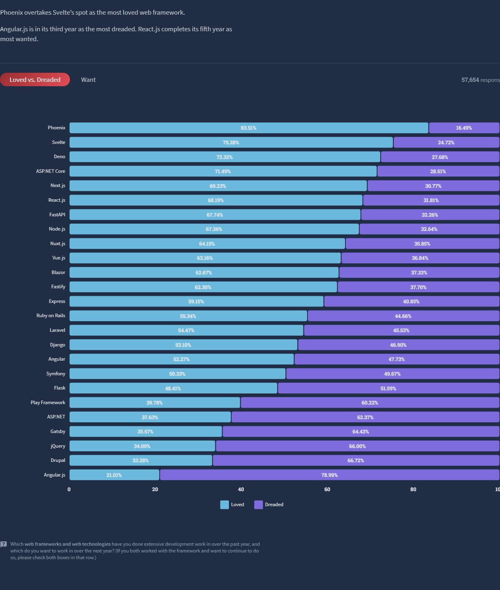
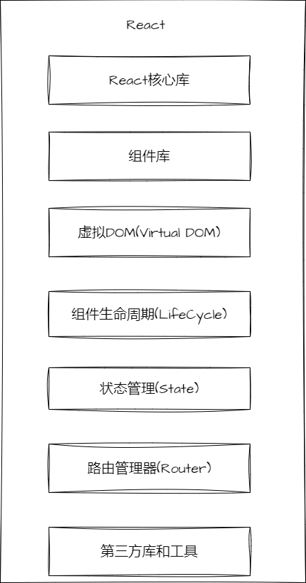
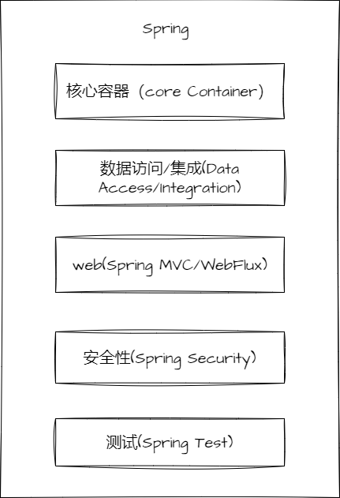
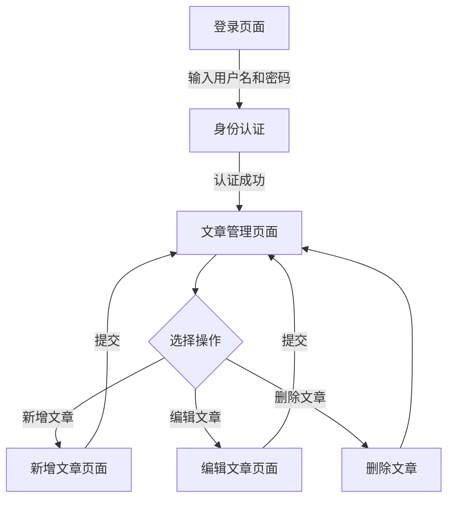

# 关于前后端主流框架的调查报告

## 调查目的

调查前后端主流框架的优缺点，以及适用场景，为后续的项目开发提供参考。

## 调查结果

### 前端开发场景

前端开发主要分为两种场景，一种是传统的网页开发，另一种是移动端开发。传统的网页开发主要是以 PC 端为主，移动端开发主要是以手机端为主。主要都是负责前端的页面开发，以及与后端的交互。
具体而言，前端的主要工作包括以下几个方面：

- 页面开发  
  页面开发主要是负责网页的页面设计和排版，通过 HTML 和 CSS 实现网页的布局和样式，以及网页的静态效果

- 交互开发
  交互开发主要是负责网页的交互逻辑，通过 JavaScript 实现网页的动态效果，例如网页的点击事件、鼠标移动事件、键盘事件等

- 与后端的交互
  与后端的交互主要是负责前端与后端的数据交互，通过 AJAX 实现前后端的数据交互，例如网页的登录、注册、购物等功能

- 移动端开发
  移动端开发主要是负责手机端的页面开发，通过 HTML5 和 CSS3 实现手机端的页面开发，例如微信小程序、H5 页面等

- 桌面端开发
  桌面端开发主要是负责桌面端的页面开发，通过 Electron 实现桌面端的页面开发，例如微信桌面端、QQ 桌面端等

- 性能优化
  通过代码优化，提高网页的性能，减少网页的加载时间，例如可以使用 Webpack 对代码进行打包，减少 HTTP 请求次数，提高网页的加载速度

### 前端主流框架

前端主流开发框架主要包括以下几种：

- `Angular`

  `Angular` 是由 `Google` 推出的一款前端 `JavaScript` 框架，用于构建单页应用程序。

  优点：

  - 双向数据绑定：`Angular` 支持双向数据绑定，可以将表单元素和数据模型进行双向绑定，使得开发者可以更加方便地处理表单数据。
  - 组件化：`Angular` 提供了组件化的开发方式，可以将页面拆分为多个组件，使得代码更加模块化，易于维护和重用。
  - 依赖注入：`Angular` 支持依赖注入，可以将组件之间的依赖关系进行解耦，使得代码更加灵活可扩展。
  - `TypeScript`：`Angular` 使用 `TypeScript` 作为默认的开发语言，可以提供更加严格的类型检查和面向对象的编程方式，使得代码更加健壮和可维护。

  缺点：

  - 学习曲线：相对于其他前端框架，Angular 的学习曲线可能会稍微陡峭一些，需要一定的时间和精力来掌握其核心概念和使用方法。
  - 性能问题：`Angular` 的性能可能会受到复杂页面的影响，需要优化和调整页面结构和组件的使用方式。
  - 生态系统：相对于 `React` 和 `Vue`，`Angular` 的生态系统相对较小，可能会导致一些库或工具的不兼容性问题。

- `VueJS`  
  `Vue` 是一款由尤雨溪开发的渐进式 `JavaScript` 框架，用于构建用户界面。

  优点：

  - 数据驱动：`Vue` 采用数据驱动的方式来更新页面，可以自动追踪数据的变化，并相应地更新页面，使得开发者可以更加专注于数据和业务逻辑的实现。
  - 组件化：`Vue` 提供了组件化的开发方式，可以将页面拆分为多个组件，使得代码更加模块化，易于维护和重用。
  - 双向数据绑定：`Vue` 支持双向数据绑定，可以将表单元素和数据模型进行双向绑定，使得开发者可以更加方便地处理表单数据。
  - 社区支持：`Vue` 拥有庞大的社区，提供了丰富的文档和实用的工具，使得开发者可以更加轻松地学习和使用 `Vue`。
    缺点：
  - 学习曲线：相对于传统的模板引擎，Vue 的学习曲线可能会稍微陡峭一些，需要一定的时间和精力来掌握其核心概念和使用方法。

  缺点：

  - 生态系统：Vue 生态系统的更新速度非常快，可能会导致某些库或工具的不兼容性问题。
  - 性能问题：Vue 的性能可能会受到复杂页面的影响，需要优化和调整页面结构和组件的使用方式。

- `React`  
  `React` 是一个由 Facebook 推出的 JavaScript 库，用于构建用户界面。

  优点：

  - 组件化：`React` 提供了组件化的开发方式，可以将页面拆分为多个组件，使得代码更加模块化，易于维护和重用。
  - 虚拟 DOM：`React` 通过虚拟 DOM 的方式来更新页面，相比于直接操作 DOM，可以大大提高页面的性能和响应速度。
  - JSX：`React` 允许使用 JSX 语法来描述组件的结构和样式，使得代码更加简洁易懂。
  - 社区支持：`React` 拥有庞大的社区，提供了丰富的文档和实用的工具，使得开发者可以更加轻松地学习和使用 `React`。

  缺点：

  - 学习曲线：相对于传统的模板引擎，`React` 的学习曲线可能会稍微陡峭一些，需要一定的时间和精力来掌握其核心概念和使用方法。
  - 生态系统：`React` 生态系统的更新速度非常快，可能会导致某些库或工具的不兼容性问题。
  - 只关注视图层：`React` 只关注视图层的构建，对于其他方面的问题（例如路由、状态管理等），需要使用其他库或框架来解决。

- `NextJS`

  `NextJS` 是一个 `React` 框架，提供了一些有用的功能，例如服务器渲染、静态导出、预渲染等，使得构建 `React` 应用程序更加容易和高效。

  优点：

  - 服务端渲染：`NextJS` 具有内置的服务端渲染功能，可以最大限度地优化首屏加载时间。此外，它还支持动态路由，使得应用程序的路由更加灵活。
  - 静态导出：`NextJS` 可以将页面预渲染为静态 HTML 文件，从而提高应用程序的性能和可访问性。
  - 集成优秀工具：`NextJS` 集成了许多优秀的工具，例如 Webpack、Babel 和 `React` 热更新等，使得开发者可以更加高效地开发和调试应用程序。
  - 社区支持：`NextJS` 拥有活跃的社区，提供了广泛的文档和实用的资源，使得开发者可以更加轻松地学习和使用 `NextJS`。

  缺点：

  - 学习曲线：相对于其他 `React` 框架，`NextJS` 的学习曲线可能会稍微陡峭一些，需要一定的时间和精力来掌握其核心概念和功能。
  - 限制性：`NextJS` 的某些功能可能会对开发者的自由度造成一定的限制，例如对文件和目录结构的要求等。
  - 构建时间：使用 `NextJS` 进行服务端渲染和预渲染可能会导致构建时间较长，需要花费更多的时间和资源。

- `NuxtJs`  
  `NuxtJS` 是一个基于 `Vue` 的通用应用框架，用于构建 `SSR`（`Server Side Render`）应用。

  优点：

  - 快速开发：`NuxtJS` 提供了许多常用的功能和配置，使得开发者可以更加快速地搭建应用程序。
  - SEO：`NuxtJS` 支持 SSR，可以在服务器端渲染页面，使得搜索引擎可以更好地索引页面内容，提高 SEO 的效果。
  - 自动化配置：`NuxtJS` 自动化处理了许多配置，减少了开发者的重复性工作，提高了开发效率。
  - 插件机制：`NuxtJS` 提供了丰富的插件机制，可以轻松地集成第三方库或插件，并且自动处理相关配置。

  缺点：

  - 学习曲线：相对于 `Vue`，`NuxtJS` 的学习曲线可能会稍微陡峭一些，需要一定的时间和精力来掌握其核心概念和使用方法。
  - 约束性：`NuxtJS` 的一些约束性规则可能会限制开发者的自由度，需要遵循一些框架的规范和约定。
  - SSR 的性能问题：SSR 应用程序的性能可能会受到服务器资源的限制，需要进行优化和调整页面结构和组件的使用方式。

这是一张`stackOverflow`的 2022 的年度总结，从全球`web`发展角度来看，框架之争已经从第一阶段的前端框架之争（比如`Vue`、`React`、`Angular`等），过渡到第二阶段的全栈框架之争（比如`Next`、`Nuxt`、`Remix`等）

### React 的相关技术

#### React 的周边库

- `React Router`：是一个基于 `React`的路由库，用于构建单页应用。它允许我们在不刷新页面的情况下切换视图。
- `Redux`：是一个状态管理库，用于管理 `JavaScript` 应用程序的状态。`Redux` 是一个可预测的状态容器，它帮助你管理应用的状态，使其行为一致且可预测。
- `MobX`：是另一个流行的状态管理库，它通过透明的函数响应式编程和可观察性的概念使状态管理变得简单直观。
- `Axios`：是一个基于 `promise` 的 `HTTP` 客户端，用于浏览器和 `Node.js`。`Axios` 使得 `API` 的请求和处理变得更加容易。

`React`的架构图是非常复杂的，因为它需要与各种库和工具配合使用。简单来说，一个典型的 `React`应用程序的架构可能包括以下几个部分：React 组件、状态管理库（如 Redux 或 MobX）、路由库（如 `React Router`）、API 请求库（如 Axios）等。这些部分共同构成了一个强大的前端应用架构。

#### React 的技术架构图

### 后端开发场景

后端开发主要包括以下几种场景：

- 服务端渲染：  
  服务端渲染是指在服务器端将页面渲染为 HTML 文件，然后将其发送到客户端，客户端收到响应后直接展示页面内容。服务端渲染可以提高首屏加载时间，从而提高应用程序的性能和可访问性。
- 静态导出：  
  静态导出是指在构建时将页面预渲染为静态 HTML 文件，然后将其发送到客户端，客户端收到响应后直接展示页面内容。静态导出可以提高应用程序的性能和可访问性，但是不支持动态路由。
- 客户端渲染：  
  客户端渲染是指在客户端将页面渲染为 HTML 文件，然后将其发送到客户端，客户端收到响应后直接展示页面内容。客户端渲染可以提高应用程序的性能和可访问性，但是可能会导致首屏加载时间较长。
- API：  
  API 是指在服务器端提供接口，客户端通过接口获取数据，然后将其展示到页面上。API 可以提高应用程序的性能和可访问性，但是需要开发者自己实现页面的渲染逻辑。
- 代理：  
  代理是指在服务器端代理客户端的请求，然后将其发送到其他服务器，最后将响应返回给客户端。代理可以提高应用程序的性能和可访问性，但是需要开发者自己实现页面的渲染逻辑。
- 数据库：  
  数据库是指在服务器端存储数据，客户端通过接口获取数据，然后将其展示到页面上。数据库可以提高应用程序的性能和可访问性，但是需要开发者自己实现页面的渲染逻辑。
- 服务器：  
  服务器是指在服务器端运行应用程序，客户端通过接口获取数据，然后将其展示到页面上。服务器可以提高应用程序的性能和可访问性，但是需要开发者自己实现页面的渲染逻辑。

### 后端主流框架

后端目前主流的框架主要包括以下几种：

- `Spring` 框架
  `Spring` 框架是一款 `Java` 开发框架，适用于构建企业级应用程序。它提供了大量的功能模块和插件，例如 `Spring MVC`、S`pring Boot`、`Spring Security` 等，可以快速搭建后端应用程序。  
   优点

  - 是具有良好的扩展性和灵活性，可以与众多的第三方库和框架集成。
  - 提供了丰富的文档和实用的工具，使得开发者可以更加轻松地学习和使用 `Spring`。

  缺点

  - 学习曲线较为陡峭，需要具备相当的 `Java` 基础和编程经验。
  - 由于 Spring 框架的复杂性，可能会导致应用程序的性能较低。

- `Django` 框架
  `Django` 框架是一款 `Python` 开发框架，适用于构建 `Web` 应用程序和 `API` 接口。它具有强大的 `ORM` 支持，便于进行数据库设计和管理。此外，`Django` 还提供了许多有用的插件和工具，例如 `Django REST framework`、`Django CMS` 等。  
   优点

  - 易于上手，具有良好的可维护性和安全性。

  缺点

  - 性能相对较低，不适合处理高并发请求。

- `Ruby on Rails` 框架  
  `Ruby on Rails` 框架是一款 `Ruby` 开发框架，适用于快速构建 `Web` 应用程序。它采用了 `MVC` 架构模式，提供了强大的 `ORM` 支持和模板引擎等功能。

  优点

  - 具有高效的开发效率和灵活的扩展性。

  缺点

  - 性能较低，不适合处理高并发请求。

- `Node.js` 框架
  `Node.js` 框架是一款 `JavaScript` 开发框架，适用于构建 `Web` 应用程序和 `API` 接口。它采用了单线程事件驱动模型，具有高效的 `I/O` 操作和异步编程特性。

  优点

  - 是具有高效的处理能力和良好的可扩展性。

  缺点

  - 对开发人员的要求较高，需要具备一定的 `JavaScript` 编程经验。

### Spring 的技术架构图

#### Srping 的插件

- `Spring Boot`
  `Spring Boot` 是一款基于 Spring 框架的开发框架，它提供了一系列的插件和工具，可以快速搭建后端应用程序。此外，Spring Boot 还提供了丰富的文档和实用的工具，使得开发者可以更加轻松地学习和使用 Spring。

- `Spring Cloud`
  `Spring Cloud` 是一款基于 `Spring Boot` 的开发框架，它提供了一系列的插件和工具，可以快速搭建后端应用程序。此外，`Spring Cloud` 还提供了丰富的文档和实用的工具，使得开发者可以更加轻松地学习和使用 Spring。

- `Spring Security`

  `Spring Security` 是一款基于 `Spring Boot` 的开发框架，它提供了一系列的插件和工具，可以快速搭建后端应用程序。此外，`Spring Security` 还提供了丰富的文档和实用的工具，使得开发者可以更加轻松地学习和使用 Spring。

- `Spring MVC`
  `Spring MVC` 是一款基于 `Spring Boot` 的开发框架，它提供了一系列的插件和工具，可以快速搭建后端应用程序。此外，`Spring MVC` 还提供了丰富的文档和实用的工具，使得开发者可以更加轻松地学习和使用 Spring。

#### Spring 的技术架构图

## 参考链接

- [六千字漫谈 2022 后端框架流行趋势](https://juejin.cn/post/7053950913551007780)
- [尤雨溪解读 2022Web 前端生态趋势](https://juejin.cn/post/7124551017382805518)
- [2022 前端行业的趋势总结，押宝 Vue3](https://zhuanlan.zhihu.com/p/476254647#:~:text=2022%20%E5%89%8D%E7%AB%AF%E8%A1%8C%E4%B8%9A%E7%9A%84%E8%B6%8B%E5%8A%BF%E6%80%BB%E7%BB%93%EF%BC%8C%E6%8A%BC%E5%AE%9DVue3%EF%BC%9F%201%201.%20%E5%9F%BA%E7%A1%80%E6%A1%86%E6%9E%B6%2F%E5%B7%A5%E7%A8%8B%E5%8C%96%20%E9%9A%8F%E7%9D%80%20jQuery.js%20%E6%B8%90%E6%B8%90%E6%B7%A1%E5%87%BA%E4%BA%BA%E4%BB%AC%E7%9A%84%E8%A7%86%E9%87%8E%EF%BC%8C%E5%89%8D%E7%AB%AF%E5%BC%80%E5%8F%91%E6%A1%86%E6%9E%B6%E6%88%90%E4%B8%BA%E4%BA%86%E5%BC%80%E5%8F%91%E4%BA%BA%E5%91%98%E5%BF%85%E4%B8%8D%E5%8F%AF%E5%B0%91%E7%9A%84%E5%B7%A5%E5%85%B7%EF%BC%8C%E4%B9%9F%E6%88%90%E4%B8%BA%E5%A4%A7%E5%AE%B6%E6%9C%80%E4%B8%BA%E5%85%B3%E6%B3%A8%E7%9A%84%E4%B8%9C%E8%A5%BF%E3%80%82,%E2%86%93%20...%205%205.%20%E6%80%BB%E7%BB%93%20%E5%9C%A8%E5%B7%A5%E4%B8%9A4.0%E7%9A%84%E5%A4%A7%E8%83%8C%E6%99%AF%E4%B8%8B%EF%BC%8C%E9%9A%8F%E7%9D%80%E4%BA%BA%E5%B7%A5%E6%99%BA%E8%83%BD%E3%80%81%E4%BA%91%E8%AE%A1%E7%AE%97%E3%80%81%E5%A4%A7%E6%95%B0%E6%8D%AE%E3%80%81%E7%89%A9%E8%81%94%E7%BD%91%E3%80%81%E5%8C%BA%E5%9D%97%E9%93%BE%E7%AD%89%E4%BA%92%E8%81%94%E7%BD%91%E6%BD%AE%E6%B5%81%E6%8A%80%E6%9C%AF%E7%9A%84%E4%B8%8D%E6%96%AD%E6%8E%A8%E8%BF%9B%EF%BC%8C%E4%BA%92%E8%81%94%E7%BD%91%E8%A1%8C%E4%B8%9A%E8%B5%B0%E5%90%91%E5%B7%A5%E4%B8%9A%E5%8C%96%E5%92%8C%E6%99%BA%E8%83%BD%E5%8C%96%E3%80%82%20%E5%85%A8%E7%90%83%E7%96%AB%E6%83%85%E7%9A%84%E5%B8%B8%E6%80%81%E5%8C%96%EF%BC%8C%E8%B6%8A%E6%9D%A5%E8%B6%8A%E5%A4%9A%E7%9A%84%E5%85%AC%E5%8F%B8%E9%80%89%E6%8B%A9%E6%88%96%E8%80%85%E4%B8%8D%E5%BE%97%E4%B8%8D%E5%B1%85%E5%AE%B6%E5%8A%9E%E5%85%AC%EF%BC%88WFH%EF%BC%89%EF%BC%8C%E5%BF%85%E7%84%B6%E7%BB%99%E5%89%8D%E7%AB%AF%E8%A1%8C%E4%B8%9A%E5%B8%A6%E6%9D%A5%E6%9B%B4%E5%A4%9A%E7%9A%84%E6%9C%BA%E4%BC%9A%E3%80%82%20)
- [2022 年，web 开发后端框架就用这 10 个](https://zhuanlan.zhihu.com/p/554023066)
- [未来全栈框架会卷方向](https://juejin.cn/post/7236278986257629221)

